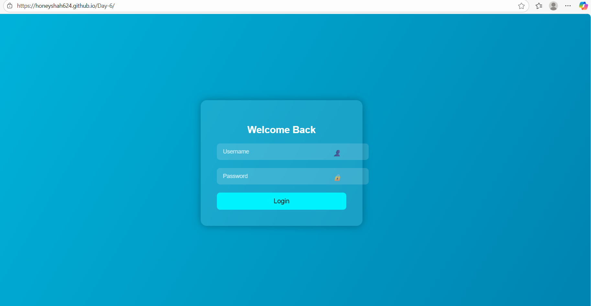

#  Host a Static Website with GitHub Pages

##  Project Overview
This project demonstrates how to host a **static HTML/CSS/JavaScript** website using **GitHub Pages** with automated deployment via **GitHub Actions**.  
The website is a **modern login page** featuring a glassmorphism UI, gradient background, and basic login validation.

---

##  Pre- requisite
+  index.html  

+  style.css   

+  script.js   

+ .github/workflows

+  static.yml    

---

##  Code

### **index.html**
```html
<!DOCTYPE html> 
<html lang="en">
<head>
<meta charset="UTF-8" />
<meta name="viewport" content="width=device-width, initial-scale=1.0" />
<title>Cool Login Page</title>
<link rel="stylesheet" href="style.css">
</head>
<body>
  <div class="login-container">
    <h2>Welcome Back</h2>
    <div class="input-group">
      <input type="text" id="username" placeholder="Username" />
      <i>👤</i>
    </div>
    <div class="input-group">
      <input type="password" id="password" placeholder="Password" />
      <i>🔒</i>
    </div>
    <button onclick="login()">Login</button>
    <div class="error-message" id="error-msg">Invalid username or password!</div>
  </div>

<script src="script.js"></script>
</body>
</html>
```
### **style.css**  

```css
body {
  margin: 0;
  padding: 0;
  font-family: 'Poppins', sans-serif;
  background: linear-gradient(120deg, #00b4db, #0083b0);
  height: 100vh;
  display: flex;
  justify-content: center;
  align-items: center;
}

.login-container {
  background: rgba(255, 255, 255, 0.1);
  padding: 40px;
  border-radius: 15px;
  backdrop-filter: blur(10px);
  box-shadow: 0 0 20px rgba(0,0,0,0.3);
  width: 320px;
  text-align: center;
  color: #fff;
}

.login-container h2 {
  margin-bottom: 20px;
  font-weight: 600;
}

.input-group {
  position: relative;
  margin: 20px 0;
}

.input-group input {
  width: 100%;
  padding: 12px 40px 12px 15px;
  border: none;
  outline: none;
  border-radius: 8px;
  font-size: 14px;
  background: rgba(255, 255, 255, 0.15);
  color: #fff;
}

.input-group input::placeholder {
  color: rgba(255, 255, 255, 0.7);
}

.input-group i {
  position: absolute;
  right: 12px;
  top: 12px;
  color: rgba(255, 255, 255, 0.7);
}

button {
  width: 100%;
  padding: 12px;
  border: none;
  background: #00f2fe;
  color: #000;
  font-size: 16px;
  border-radius: 8px;
  cursor: pointer;
  transition: 0.3s;
}

button:hover {
  background: #4facfe;
  transform: translateY(-2px);
}

.error-message {
  margin-top: 10px;
  color: #ff6b6b;
  font-size: 13px;
  display: none;
}
```

### **script.js**
```js
function login() {
  const user = document.getElementById("username").value.trim();
  const pass = document.getElementById("password").value.trim();
  const errorMsg = document.getElementById("error-msg");

  if (user === "admin" && pass === "1234") {
    alert("Login successful!");
  } else {
    errorMsg.style.display = "block";
  }
}
```
<br>

## .github/workflows/static.yml

### Step-1: Simple workflow for deploying static content to GitHub Pages
name: Deploy static content to Pages

on:
  + Runs on pushes targeting the default branch
  push:
    
    + branches: ["main"]

  + Allows you to run this workflow manually from the Actions tab
  workflow_dispatch:

### Step-2: Sets permissions of the GITHUB_TOKEN to allow deployment to GitHub Pages
+ permissions:

+ contents: read

+ pages: write

+ id-token: write


### Step-3: Allow only one concurrent deployment, skipping runs queued between the run in-progress and latest queued. However, do NOT cancel in-progress runs as we want to allow these production deployments to complete.
+ concurrency:

+ group: "pages"

+ cancel-in-progress: false

### Step-4:  Single deploy job since we're just deploying
```
deploy:
    environment:
      name: github-pages
      url: ${{ steps.deployment.outputs.page_url }}
    runs-on: ubuntu-latest
    steps:
      - name: Checkout
        uses: actions/checkout@v4
      - name: Setup Pages
        uses: actions/configure-pages@v5
      - name: Upload artifact
        uses: actions/upload-pages-artifact@v3
        with:
          # Upload entire repository
          path: '.'
      - name: Deploy to GitHub Pages
        id: deployment
        uses: actions/deploy-pages@v4
```

### Step-5: Deployment Steps
---
Create a GitHub repository and upload all files.

Push your code:

```bash

git init
git add .
git commit -m "Initial commit"
git branch -M main
git remote add origin <your-repo-url>
git push -u origin main
```
Enable GitHub Pages:

Go to Settings → Pages.

Select branch main and folder / (root).

Automatic Deployment:

On every push to main, GitHub Actions (static.yml) will deploy your site automatically.

### Step-6: Access your site:
---
GitHub provides a link:

https://github.com/Honeyshah624/Day-6
---


### Step-7: How to Use
---
Visit the deployed site.

Enter Username: admin

Password: 1234

Click Login:

If correct → Success alert.

If incorrect → Error message.




